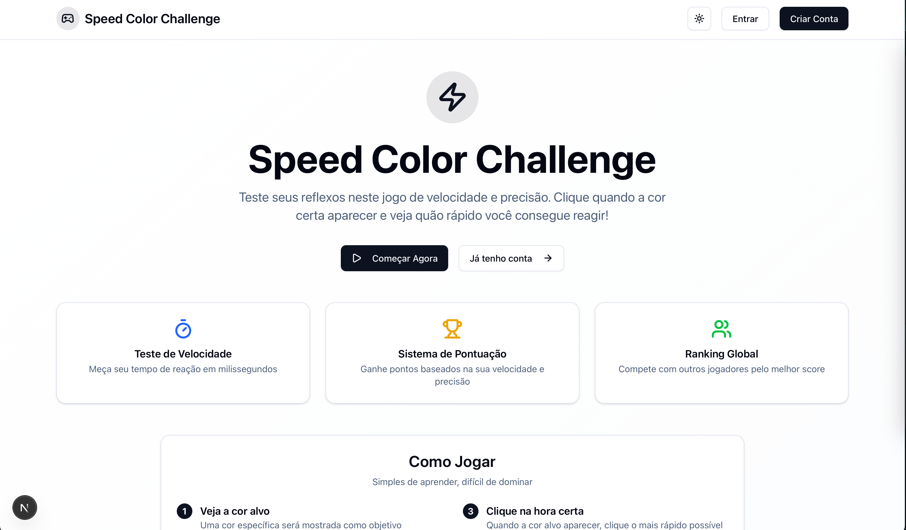
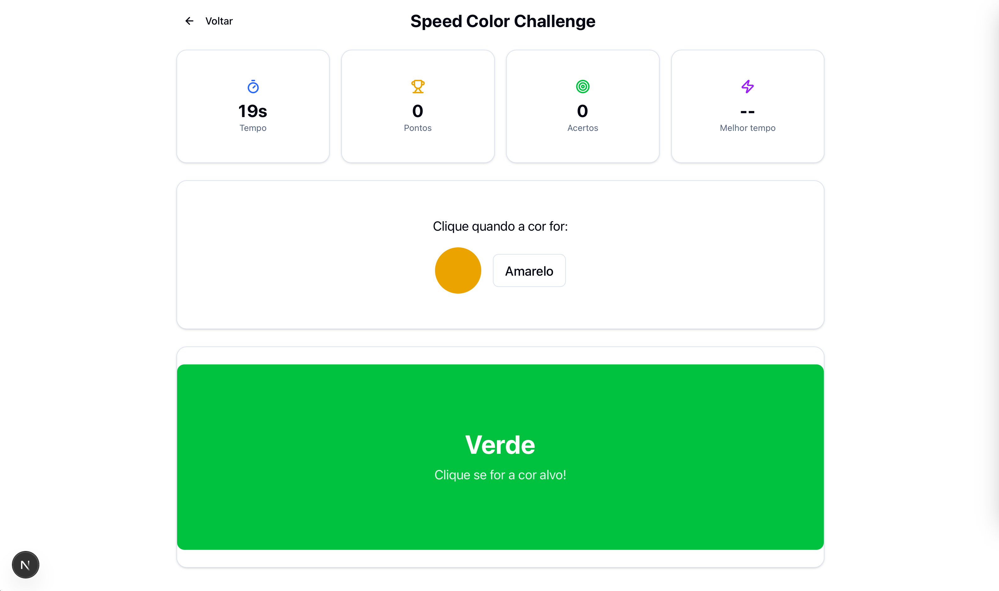

# 🎮 Speed Color Challenge

<p align="center">
  
</p>

<p align="center">
  <strong>Um jogo de reação rápida que testa seus reflexos e precisão!</strong>
</p>

<p align="center">
  
</p>

---

## 📋 Sobre o Projeto

**Speed Color Challenge** é uma aplicação web full-stack que oferece uma experiência de jogo viciante onde os usuários testam sua velocidade de reação. O objetivo é simples: clique quando a cor correta aparecer na tela. Quanto mais rápido você reagir, maior será sua pontuação!

### 🎯 Características Principais

- **⚡ Gameplay Dinâmico**: Jogo de 30 segundos com cores que mudam constantemente
- **🏆 Sistema de Pontuação**: Pontos baseados na velocidade de reação (até 1000 pontos por acerto)
- **📊 Estatísticas Detalhadas**: Tempo de reação, precisão, histórico de jogos
- **🥇 Ranking Global**: Compete com outros jogadores pelo melhor score
- **🌓 Tema Escuro/Claro**: Interface adaptável com troca de temas
- **📱 Design Responsivo**: Funciona perfeitamente em mobile, tablet e desktop
- **🔐 Autenticação JWT**: Sistema seguro de login e registro

## 🏗️ Arquitetura do Projeto

Este é um **monorepo** organizado com npm workspaces, contendo:

```
game-app/
├── apps/
│   ├── api/          # Backend Express + TypeScript + Prisma
│   └── web/          # Frontend Next.js + ShadCN UI
├── packages/
│   └── shared/       # Tipos e schemas compartilhados
└── assets/           # Imagens e recursos
```

### 🛠️ Stack Tecnológica

#### **Backend (API)**
- **Express.js** - Framework web rápido e minimalista
- **TypeScript** - Tipagem estática para JavaScript
- **Prisma ORM** - ORM moderno para banco de dados
- **SQLite** - Banco de dados leve para desenvolvimento
- **JWT** - Autenticação baseada em tokens
- **Zod** - Validação de schemas TypeScript-first
- **bcrypt** - Hash seguro de senhas

#### **Frontend (Web)**
- **Next.js 15** - Framework React com Turbopack
- **React 18** - Biblioteca para interfaces de usuário
- **TypeScript** - Tipagem estática
- **ShadCN UI** - Componentes UI modernos e acessíveis
- **Tailwind CSS** - Framework CSS utilitário
- **React Hook Form** - Gerenciamento de formulários
- **next-themes** - Sistema de temas claro/escuro

#### **Shared Package**
- **Zod** - Schemas de validação compartilhados
- **TypeScript** - Tipos compartilhados entre frontend e backend

## 🚀 Como Executar o Projeto

### Pré-requisitos
- **Node.js** (versão 18 ou superior)
- **npm** (versão 8 ou superior)

### 1️⃣ Clone o Repositório
```bash
git clone https://github.com/ArturRSA19/Speed-Color-Game.git
cd Speed-Color-Game
```

### 2️⃣ Instale as Dependências
```bash
npm install
```

### 3️⃣ Configure o Banco de Dados
```bash
# Executar migrações do Prisma
npm run prisma:migrate --workspace=api

# (Opcional) Visualizar banco com Prisma Studio
npm run prisma:studio --workspace=api
```

### 4️⃣ Inicie os Servidores
```bash
# Inicia API (porta 9999) e Frontend (porta 3000) simultaneamente
npm run dev
```

### 5️⃣ Acesse a Aplicação
- **Frontend**: http://localhost:3000
- **API**: http://localhost:9999
- **Prisma Studio**: http://localhost:5555 (se executado)

## 🎮 Como Jogar

1. **📝 Crie uma conta** ou faça login
2. **🎯 Observe a cor alvo** mostrada no topo
3. **👀 Aguarde** até que essa cor apareça na tela grande
4. **⚡ Clique rapidamente** quando a cor correta aparecer
5. **🏆 Acumule pontos** baseados na sua velocidade de reação
6. **📊 Veja suas estatísticas** e tente melhorar seu recorde!

## 📊 Sistema de Pontuação

- **Pontuação Base**: 1000 pontos por acerto correto
- **Penalidade por Tempo**: Diminui conforme a velocidade de reação
- **Fórmula**: `Pontos = max(1000 - tempo_reação_ms, 100)`
- **Exemplo**: Reação de 250ms = 750 pontos

## 🗂️ Scripts Disponíveis

### Scripts Globais (Raiz)
```bash
npm run dev              # Inicia API e Web em paralelo
npm run build           # Build de todos os workspaces
npm run clean           # Limpa node_modules e builds
```

### Scripts da API
```bash
npm run dev --workspace=api              # Inicia servidor de desenvolvimento
npm run build --workspace=api            # Build da API
npm run prisma:migrate --workspace=api   # Executar migrações
npm run prisma:studio --workspace=api    # Interface visual do banco
```

### Scripts do Frontend
```bash
npm run dev --workspace=web     # Inicia servidor Next.js
npm run build --workspace=web   # Build do frontend
npm run start --workspace=web   # Inicia versão de produção
```

## 🌐 Endpoints da API

### Autenticação
- `POST /auth/register` - Registro de usuário
- `POST /auth/login` - Login de usuário

### Records (Requer Autenticação)
- `GET /records/me` - Histórico pessoal de scores
- `POST /records` - Salvar novo score
- `GET /records/leaderboard` - Ranking global
- `GET /records/stats` - Estatísticas gerais

## 🎨 Funcionalidades da Interface

### 🏠 Homepage
- Apresentação do jogo e suas funcionalidades
- Call-to-action para registro
- Instruções de como jogar

### � Autenticação
- Formulários de login e registro responsivos
- Validação em tempo real
- Tratamento de erros amigável
- Alternância de visibilidade de senha

### 📊 Dashboard
- Perfil do usuário com estatísticas
- Histórico de scores com filtros
- Botão de acesso rápido ao jogo
- Alternador de tema claro/escuro

### 🎮 Jogo
- Interface intuitiva e responsiva
- Estatísticas em tempo real
- Feedback visual para acertos/erros
- Tela de resultados detalhada

## 🔧 Desenvolvimento

### Estrutura de Pastas
```
apps/web/src/
├── app/                 # App Router do Next.js
│   ├── dashboard/       # Página do dashboard
│   ├── game/           # Página do jogo
│   ├── login/          # Página de login
│   └── register/       # Página de registro
├── components/         # Componentes React
│   └── ui/            # Componentes ShadCN UI
├── contexts/          # Context API (Auth)
├── hooks/             # Hooks customizados
└── lib/               # Utilitários
```

### Padrões Utilizados
- **Conventional Commits** para mensagens de commit
- **TypeScript** para tipagem estática
- **ESLint + Prettier** para padronização de código
- **Modular Architecture** com separação clara de responsabilidades

## 🚀 Deploy

O projeto está configurado para deploy fácil em plataformas modernas:

### Frontend (Vercel/Netlify)
- Build otimizado com Next.js
- Variáveis de ambiente configuradas
- Deploy automático via Git

### Backend (Railway/Render)
- Dockerfile incluído
- Migrações automáticas do Prisma
- Configuração de banco PostgreSQL para produção

### Banco de Dados
- **Desenvolvimento**: SQLite local
- **Produção**: PostgreSQL (recomendado)

## 🤝 Contribuição

1. Faça um fork do projeto
2. Crie uma branch para sua feature (`git checkout -b feat/nova-feature`)
3. Commit suas mudanças (`git commit -m 'feat: adiciona nova feature'`)
4. Push para a branch (`git push origin feat/nova-feature`)
5. Abra um Pull Request

## 📝 Licença

Este projeto está sob a licença MIT. Veja o arquivo [LICENSE](LICENSE) para mais detalhes.

## 👨‍💻 Autor

**Artur Rodrigues**
- GitHub: [@ArturRSA19](https://github.com/ArturRSA19)
- LinkedIn: [Conecte-se comigo](https://linkedin.com/in/seu-perfil)

---

<p align="center">
  <strong>🎮 Divirta-se jogando e testando seus reflexos! 🎮</strong>
</p>

<p align="center">
  Feito com ❤️ usando TypeScript, Next.js e muita dedicação
</p>
